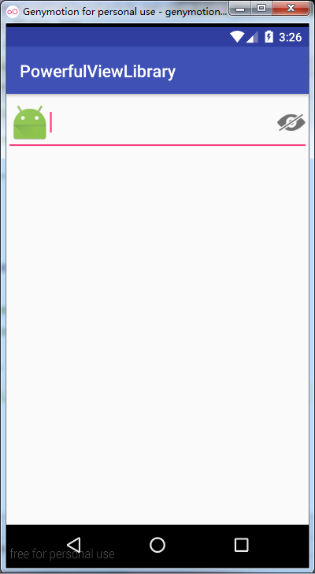

# PowerfulViewLibrary
###PowerfulEditText介绍###
####1.自带清除文本功能 ####
&emsp;&emsp;PowerfulEditText自带清除文本功能，只需在布局文件该View属性中添加funcType,指定为canClear,就可以自带清除文本功能，使用如下：

    <?xml version="1.0" encoding="utf-8"?>
	<LinearLayout
	    xmlns:android="http://schemas.android.com/apk/res/android"
	    xmlns:app="http://schemas.android.com/apk/res-auto"
	    android:layout_width="match_parent"
	    android:layout_height="match_parent"
	    android:orientation="vertical"
	>

	    <com.chaychan.viewlib.PowerfulEditText
	        android:layout_width="match_parent"
	        android:layout_height="wrap_content"
	        app:funcType="canClear"
	        />

    </LinearLayout>

运行后，效果如下：

&emsp;&emsp;上图所示的删除图标是默认的，当然也可以指定右侧删除按钮的图标，只需添加多drawableRight属性，这里建议使用一个selector，分别为普通状态和按压状态设置一张图片，这样当按压图标的时候，会有一种按压的状态，selector的编写如下：

    <?xml version="1.0" encoding="utf-8"?>
	<selector
	  xmlns:android="http://schemas.android.com/apk/res/android">
	    <item android:state_pressed="true" android:drawable="按压后的图标" />
	    <item android:drawable="普通状态的图标" />
	</selector>

####2.自带密码输入框切换明文密文格式的功能 ####

&emsp;&emsp;PowerfulEditText自带密码输入框切换明文密文格式的功能，目前大多数App密码输入栏一般支持密码明文、密文的显示，如果需要用到该功能，可以将funcType中指定为canWatchPwd,就可以轻松使用这种功能，使用如下：

    <com.chaychan.viewlib.PowerfulEditText
        android:layout_width="match_parent"
        android:layout_height="wrap_content"
        app:funcType="canWatchPwd"
        android:inputType="textPassword"
        />

运行后，效果如下：

&emsp;&emsp;上图所示的右侧图标是默认的，同样也可以指定开启查看密码的图标和关闭查看密码的图标，只需要在属性eyeOpen中指定开启查看密码引用的图片，在eyeClosed中指定关闭查看密码引用的图片即可，如下，更换开启查看密码的图标,如项目默认的图标ic_launcher

    <com.chaychan.viewlib.PowerfulEditText
        android:layout_width="match_parent"
        android:layout_height="wrap_content"
        app:funcType="canWatchPwd"
        android:inputType="textPassword"
        app:eyeOpen="@mipmap/ic_launcher"
        />

运行后，效果如下：

	

这样开启查看密码的图标就更换了，如果还需要更换关闭密码查看的图标，可以指定eyeClose，引用对应的图标。

####3.设置drawableLeft和drawableRight图片大小的功能 ####
&emsp;&emsp;原生的EditText并不能在属性中指定drawableLeft或drawableRight图片的大小，所以一般开发的过程中，一些程序员会采用简单粗暴的方法，直接引用一张宽高都很小的图片。但是在不同屏幕分辨率下，兼容性就不是很好，比如在一些屏幕分辨率较高的手机上运行，图标会显得模糊。PowerfulEditText可以指定drawableLeft和drawableRight图片的宽高大小，可以指定为多少个dp,这样在开发的时候，可以在各个分辨率图片文件夹中放入不同尺寸的图标，通过设定图片的宽高属性来限制显示的大小，下面演示一下：

    <com.chaychan.viewlib.PowerfulEditText
        android:layout_width="match_parent"
        android:layout_height="wrap_content"
        app:funcType="canWatchPwd"
        android:inputType="textPassword"
        android:drawableLeft="@mipmap/ic_launcher"
        />

&emsp;&emsp;如图，指定了drawableLeft的图片为ic_laucher,图片看起来比较大，这时如果我们想要将其调小，则可以添加leftDrawableWidth、leftDrawableHeight指定左侧图片的宽高。

    <com.chaychan.viewlib.PowerfulEditText
        android:layout_width="match_parent"
        android:layout_height="wrap_content"
        app:funcType="canWatchPwd"
        android:inputType="textPassword"
        android:drawableLeft="@mipmap/ic_launcher"
        app:leftDrawableWidth="30dp"
        app:leftDrawableHeight="30dp"
        />

上面代码，指定了leftDrawableWidth和leftDrawableHeight的大小都为30dp，运行的效果如下：

可以看到左侧的图标变小了，同样也可以设置右侧图片的宽高，对应的属性是rightDrawableWidth、rightDrawableHeight。

####右侧图标点击事件####
PowerfulEditText同样支持右侧图片的点击事件，如果funcType指定为canClear，则默认点击是清除文本。如果需要进行一些额外的操作，则可以设置回调，比如搜索输入框，右侧是一个搜索的按钮，需要为其设置点击事件的回调。

布局文件：

     <com.chaychan.viewlib.PowerfulEditText
        android:id="@+id/pet"
        android:layout_width="match_parent"
        android:layout_height="wrap_content"
        android:drawableRight="@mipmap/search"
        />

Activity
     
      PowerfulEditText petUsername = (PowerfulEditText) findViewById(R.id.pet);
        petUsername.setOnRightClickListener(new PowerfulEditText.OnRightClickListener() {
            @Override
            public void onClick(EditText editText) {
                String content = editText.getText().toString().trim();
                if (！TextUtils.isEmpty(content)){
                    Toast.makeText(MainActivity.this, "执行搜索逻辑", Toast.LENGTH_SHORT).show();
                }
            }
        });

运行效果如下：

    
&emsp;&emsp;上面布局文件中，和普通的EditText属性一样，funcType一共有三个属性，分别是normal(默认)、canClear(带清除功能)、canWatchPwd（带查看密码功能）。如果不指定funcType，则默认是normal,普通方式。

&emsp;&emsp;Activity中，为PowerfulEditText设置右侧图片的点击事件，调用setOnRightClickListener设置点击后的回调，这里点击后如果有文本内容，则执行搜索逻辑。

&emsp;&emsp;关于PowerfulEditText的源码解析可以观看我的博客 [http://blog.csdn.net/chay_chan/article/details/63685905](http://blog.csdn.net/chay_chan/article/details/63685905)

###NumberRunningTextView介绍
&emsp;&emsp;NumberRunningTextView是一个自带数字滚动动画的TextView,通过使用setContent(String str)方法，传入相应的金额数字字符串（如"1354.00"），或者数字的字符串（如200）,当页面初始化完成的时候，就可以看到数字滚动的效果，和支付宝中进入余额宝界面，显示余额滚动的效果类似，具体的效果如下：

###使用
在布局文件中，使用NumberRunningTextView，代码如下：

演示金额滚动的NumberRunningTextView

     <com.chaychan.viewlib.NumberRunningTextView
                android:id="@+id/tv_money"
                android:layout_width="wrap_content"
                android:layout_height="wrap_cointent"
                android:layout_centerInParent="true"
                android:text="0.00"
                android:textColor="#fff"
                android:textSize="30sp"
                android:textStyle="bold"
                />

演示整数数字滚动的NumberRunningTextView

     <com.chaychan.viewlib.NumberRunningTextView
                android:id="@+id/tv_num"
                android:layout_width="wrap_content"
                android:layout_height="wrap_content"
                android:layout_centerInParent="true"
                android:text="200"
                android:textColor="#fff"
                android:textSize="30sp"
                app:textType="num"
                />

&emsp;&emsp;二者的区别在于textType的设置，textType是用于指定内容的格式，总共有money(金钱格式，带小数)和num（整数格式），默认是金钱的格式，不配置textType的话，默认就是使用金钱格式。

在java文件中根据id找到对应的view后，调用setContent()方法即可。

     tvMoney.setContent("1354.00");
     tvNum.setContent("200");

####关闭金额的自动格式化（每三位数字添加一个逗号）
&emsp;&emsp;上图所示，最后显示的金额数字经过了处理，每三位添加一个逗号，这使得数字看起来比较好看，金额默认是使用这种格式，如果不想要这种格式的数字，可以在布局文件中，NumberRunningTextView的配置中，将useCommaFormat设置为false,这样最终的数字就不会是带有逗号了，效果如下：

####关闭执行动画的时机
&emsp;&emsp;当一开始进入界面的时候，初始化数据完毕，NumberRunningTextView设置数据完毕，会自动执行数字滚动的动画，如果进行刷新操作，从服务器获取新的数据，重新设置数据，NumberRunningTextView会自动判断传入的内容是否有变化，如果没有变化，则不会再次滚动，这和支付宝的余额宝界面中的金额类似，当在余额宝界面下拉刷新时，金额没有变化，数字不会再次滚动，而当提现后重新回到该界面，金额发生变化后，就会再次滚动，效果如下:

SwipeRefreshLayout的刷新回调中，只做了这样的处理，NumberRunningTextView设置的内容还是原来的数据。

     srlRoot.setOnRefreshListener(new SwipeRefreshLayout.OnRefreshListener() {
            @Override
            public void onRefresh() {
                tvMoney.setContent("1354.00");
                tvNum.setContent("200");
                srlRoot.setRefreshing(false);
            }
        });

&emsp;&emsp;当你进行下拉刷新的时候，内容如果没有发生变化，数字是不会滚动的，如果内容发生变化，数字又会重新进行滚动,这里修改下拉刷新的代码,模拟数据变化的情况，演示一下：
   
	 srlRoot.setOnRefreshListener(new SwipeRefreshLayout.OnRefreshListener() {
            @Override
            public void onRefresh() {
                tvMoney.setContent("1454.00");
                tvNum.setContent("300");
                srlRoot.setRefreshing(false);
            }
        });

效果如下：

&emsp;&emsp;如果想要在刷新的时候，无论内容是否有变化都要执行滚动动画的话，可以在布局文件中，NumberRunningTextView的配置中，将runWhenChange设置为false即可,此时，无论内容是否有变化，都会执行滚动动画，效果如下：

####修改帧数
&emsp;&emsp;NumberRunningTextView默认是30帧，如果需要修改帧数，可以在布局文件中，NumberRunningTextView的配置中，将frameNum设置为自己想要的帧数。

&emsp;&emsp;关于NumberRunningTextView的源码解析可以查看我的博客 [http://blog.csdn.net/chay_chan/article/details/70196478](http://blog.csdn.net/chay_chan/article/details/70196478)

##ExpandableLinearLayout介绍
###场景介绍
&emsp;&emsp;开发的过程中，有时我们需要使用到这样一个功能，在展示一些商品的时候，默认只显示前几个，例如先显示前三个，这样子不会一进入页面就被商品列表占据了大部分，可以先让用户可以看到页面的大概，当用户需要查看更多的商品时，点击“展开”，就可以看到被隐藏的商品，点击“收起”，则又回到一开始的状态，只显示前几个，其他的收起来了。就拿美团外卖的订单详情页的布局作为例子，请看以下图片：

    

&emsp;&emsp;订单详情页面一开始只显示购买的前三样菜，当点击“点击展开”时，则将购买的所有外卖都展示出来，当点击“点击收起”时，则将除了前三样菜以外的都隐藏起来。其实要完成这样的功能并不难，为了方便自己和大家以后的开发，我将其封装成一个控件，取名为ExpandableLinearLayout，下面开始介绍它如何使用以及源码解析。

##使用方式
###一、使用默认展开和收起的底部
在布局文件中，使用ExpandableLinearLayout，代码如下：

    <com.chaychan.viewlib.ExpandableLinearLayout
            android:id="@+id/ell_product"
            android:layout_width="match_parent"
            android:layout_height="wrap_content"
            android:layout_marginTop="10dp"
            android:orientation="vertical"
			app:useDefaultBottom="true"
            app:defaultItemCount="2"
            app:expandText="点击展开"
            app:hideText="点击收起"
            ></com.chaychan.viewlib.ExpandableLinearLayout>

和LinearLayout的使用方法类似，如果是静态数据，可以在两个标签中间插入子条目布局的代码，也可以在java文件中使用代码动态插入。useDefaultBottom是指是否使用默认底部（默认为true，如果需要使用默认底部，可不写这个属性），如果是自定义的底部，则设置为false，下面会介绍自定义底部的用法，defaultItemCount="2",设置默认显示的个数为2，expandText为待展开时的文字提示，hideText为待收起时的文字提示。

在java文件中，根据id找到控件，动态往ExpandableLinearLayout中插入子条目并设置数据即可，代码如下：

    @Bind(R.id.ell_product)
    ExpandableLinearLayout ellProduct;    

      @Override
    protected void onCreate(Bundle savedInstanceState) {
        super.onCreate(savedInstanceState);
        setContentView(R.layout.page_ell_default_bottom_demo);
        ButterKnife.bind(this);

        ellProduct.removeAllViews();//清除所有的子View（避免重新刷新数据时重复添加）
        //添加数据
        for (int i = 0; i < 5; i++) {
            View view = View.inflate(this, R.layout.item_product, null);
            ProductBean productBean = new ProductBean(imgUrls[i], names[i], intros[i], "12.00");
            ViewHolder viewHolder = new ViewHolder(view, productBean);
            viewHolder.refreshUI();
            ellProduct.addItem(view);//添加子条目
        }
    }

     class ViewHolder {
        @Bind(R.id.iv_img)
        ImageView ivImg;
        @Bind(R.id.tv_name)
        TextView tvName;
        @Bind(R.id.tv_intro)
        TextView tvIntro;
        @Bind(R.id.tv_price)
        TextView tvPrice;

        ProductBean productBean;

        public ViewHolder(View view, ProductBean productBean) {
            ButterKnife.bind(this, view);
            this.productBean = productBean;
        }

        private void refreshUI() {
            Glide.with(EllDefaultBottomDemoActivity.this)
                    .load(productBean.getImg())
                    .placeholder(R.mipmap.ic_default)
                    .into(ivImg);
            tvName.setText(productBean.getName());
            tvIntro.setText(productBean.getIntro());
            tvPrice.setText("￥" + productBean.getPrice());
        }
    }

效果如下：

   

####1.支持修改默认显示的个数
可以修改默认显示的个数，比如将其修改为3，即defaultItemCount="3"

效果如下：

####2.支持修改待展开和待收起状态下的文字提示
可以修改待展开状态和待收起状态下的文字提示，比如修改expandText="查看更多"，hideText="收起更多"

效果如下：

####3.支持修改提示文字的大小、颜色

可以修改提示文字的大小和颜色，对应的属性分别是tipTextSize，tipTextColor。比如修改tipTextSize="16sp"，tipTextColor="#ff7300"

效果如下：

####4.支持更换箭头的图标
可以修改箭头的图标，只需配置arrowDownImg属性，引用对应的图标，这里的箭头图标需要是向下的箭头，这样当展开和收起时，箭头会做相应的旋转动画。设置arrowDownImg="@mipmap/arrow\_down\_grey"，修改为灰色的向下图标。

效果如下：

###二、使用自定义底部

布局文件中，ExpandableLinearLayout配置useDefaultBottom="false",声明不使用默认底部。自己定义底部的布局。

    <?xml version="1.0" encoding="utf-8"?>
	<ScrollView
	    xmlns:android="http://schemas.android.com/apk/res/android"
	    xmlns:app="http://schemas.android.com/apk/res-auto"
	    android:layout_width="match_parent"
	    android:layout_height="match_parent"
    >

	    <LinearLayout
	        android:layout_width="match_parent"
	        android:layout_height="match_parent"
	        android:orientation="vertical"
	        >
	
	        <!--商品列表-->
	        <com.chaychan.viewlib.ExpandableLinearLayout
	            android:id="@+id/ell_product"
	            android:layout_width="match_parent"
	            android:layout_height="wrap_content"
	            android:layout_marginTop="10dp"
	            android:orientation="vertical"
	            app:defaultItemCount="2"
	            app:useDefaultBottom="false"
	            >
	
	        </com.chaychan.viewlib.ExpandableLinearLayout>
	
            <!--自定义底部-->
	        <RelativeLayout...>
	          
			<!--优惠、实付款-->
	        <RelativeLayout...>
	
	    </LinearLayout>

    </ScrollView>

java文件中，代码如下：
    
     @Override
    protected void onCreate(Bundle savedInstanceState) {
  		super.onCreate(savedInstanceState);
        setContentView(R.layout.page_ell_custom_bottom_demo);
        ButterKnife.bind(this);

      ...  //插入模拟数据的代码，和上面演示使用默认底部的代码一样
     
      //设置状态改变时的回调
      ellProduct.setOnStateChangeListener(new ExpandableLinearLayout.OnStateChangeListener() {
            @Override
            public void onStateChanged(boolean isExpanded) {
                doArrowAnim(isExpanded);//根据状态箭头旋转
                //根据状态更改文字提示
                if (isExpanded) {
                    //展开
                    tvTip.setText("点击收起");
                } else {
                    tvTip.setText("点击展开");
                }
            }
        });

       //为自定义的底部设置点击事件
       rlBottom.setOnClickListener(new View.OnClickListener() {
            @Override
            public void onClick(View v) {
                ellProduct.toggle();
            }
        });

    }

	  // 箭头的动画
	  private void doArrowAnim(boolean isExpand) {
        if (isExpand) {
            // 当前是展开，箭头由下变为上
            ObjectAnimator.ofFloat(ivArrow, "rotation", 0, 180).start();
        } else {
            // 当前是收起，箭头由上变为下
            ObjectAnimator.ofFloat(ivArrow, "rotation", -180, 0).start();
        }
	 }

主要的代码是为ExpandableLinearLayout设置状态改变的回调，rlBottom为自定义底部的根布局RelativeLayout,为其设置点击事件，当点击的时候调用ExpandableLinearLayout的toggle（）方法，当收到回调时，根据状态旋转箭头以及更改文字提示。

效果如下：

到这里，ExpandableLinearLayout的使用就介绍完毕了，关于ExpandableLinearLayout的源码可以查看我的博客：[http://blog.csdn.net/Chay_Chan/article/details/72810770](http://blog.csdn.net/Chay_Chan/article/details/72810770)

####**导入方式**####
在项目根目录下的build.gradle中的allprojects{}中，添加jitpack仓库地址，如下：

    allprojects {
	    repositories {
	        jcenter()
	        maven { url 'https://jitpack.io' }//添加jitpack仓库地址
	    }
	}
 
打开app的module中的build.gradle，在dependencies{}中，添加依赖，如下：

    dependencies {
			......
	        compile 'com.github.chaychan:PowerfulViewLibrary:1.1.6'
	}
